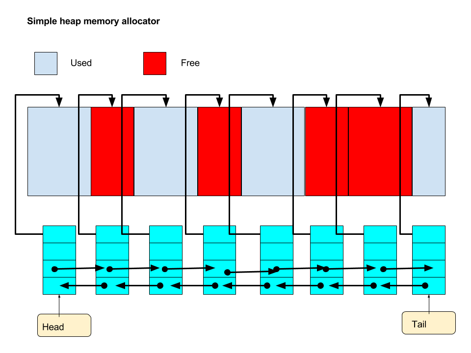
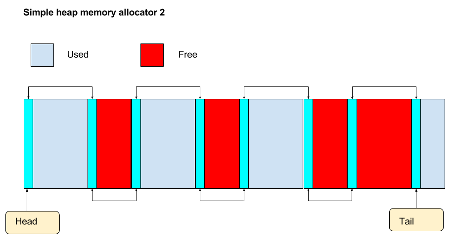
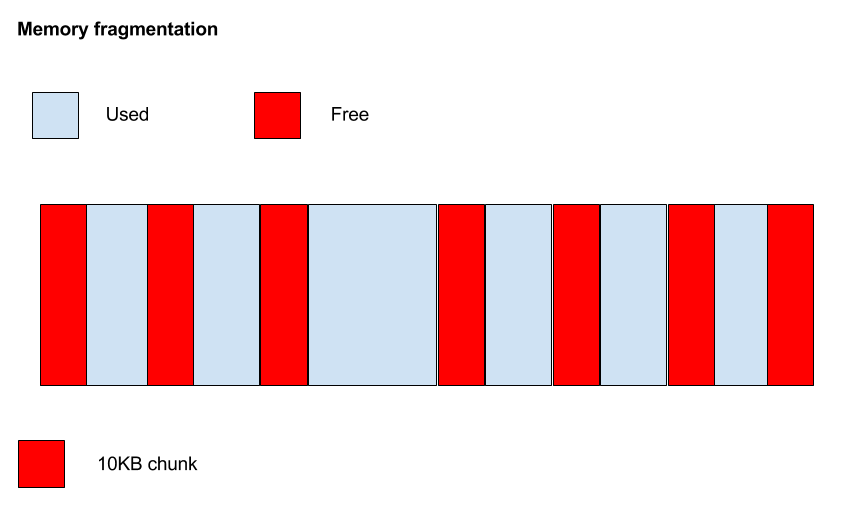
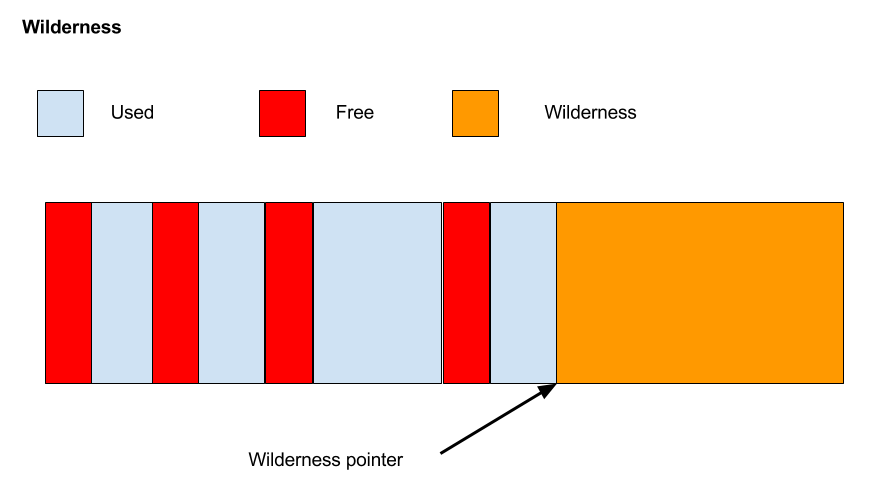
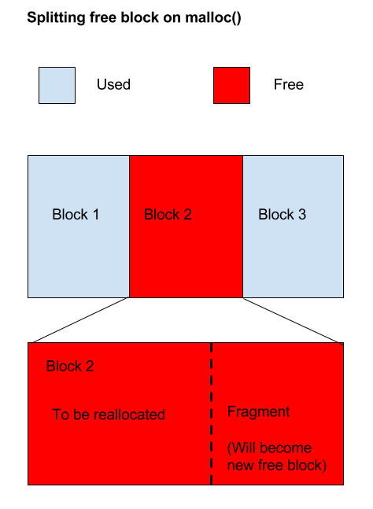
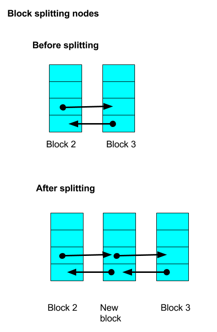
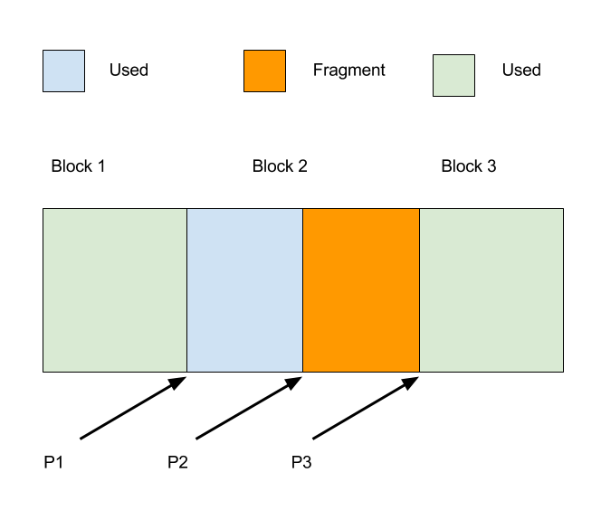
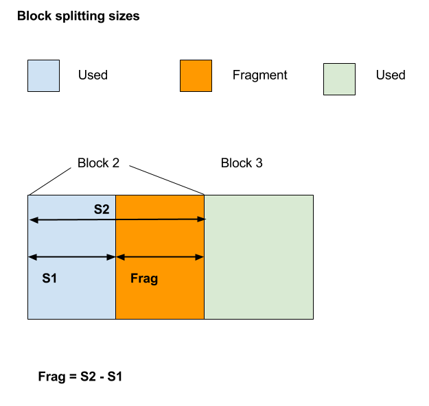

# Ant-Allocator

*Currently under construction (but should compile and run).*

A simple memory allocator for educational purposes.

Features:

* Minimal design
* Zoning possible (multiple allocators)
* Block splitting
* Block coalescing
* TODO: I have a wilderness but don't extend it on exhaustion.
* TODO: Binning / pre-allocation etc.
* Err, that's about it!

## Background

So, in a moment of madness I decided to write my own memory allocator
similar to something like `malloc()`. This was purely for the learning
experience. I also hadn't done any C programming for over 10 years so
decided it was time to get back on the horse again so to speak.

## Overview

After struggling with pen and paper for a while, I realized that it
helps to visualize the allocated memory (used and free) as separate
from the nodes that manage the blocks of memory.

The following diagram shows this:



Basic definitions of things in my implementation:

* Nodes - used for managing allocated blocks in a doubly linked-list.
* Mem - the memory the application will actually use.
* Heap - the data structure used to manage the whole thing.
* Block - The mem plus the node (containing the metadata).
* Wilderness - the big chunk of free memory after your allocated blocks (if any).

The nodes contain a pointer to the mem, the size of the mem,
whether the mem is used or not, and a couple of pointers to allow
the nodes to be hooked into a doubly-linked list.

The linked-list is used when searching for a suitable block to
allocate.

A doubly-linked list seems a bit complex, but there are points where
you will need to check the previous and next blocks to see if they are
free and therefore can be coalesced with the current block. 

Note that, in the diagram, a `free()` has meant that there are two
contiguous free blocks (adjacent red blocks) that could be coalesced
into one free block, thus helping to avoid memory fragmentation.

As another example, if you have [free, used, free] blocks and then you
free the used block you have [free, free, free]. These blocks can be
coalesced into one free block. You would first coalesce the two on the
left, and then coalesce that with the third block.

## Blocks containing metadata

For the purposes of my implementation a block is a lump that contains
both the node and the memory that the requesting application will
actually use for its own purposes.

This is shown in a modified version of the first diagram:



Note that it is necessary to allocate larger than the requested memory
size - that is, you need to allocate memory size plus node size.

As you know the location of the node in memory (calculated from ptr
passed to free(), or from walking the list during `malloc()`), you can
simply add a constant to it (the node size) to find the start point of
the actual allocation. However, a pointer to memory is stored in the
node for convenience.

Remember when implementing `free()` you would take the passed pointer
and subtract the node size to get the start of the metadata.

## Memory fragmentation

Memory fragmentation occurs where you have a number of free blocks,
but they are not of sufficient size to service a `malloc()`. You
basically end up with memory that looks like Swiss cheese - lots of
little holes. Block coalescing is one way around this - that's where
you have two free blocks that you meld together.

There are other techniques such as binning where you try to keep small
allocations in one area and larger allocations in another area. This
way you will end up with small holes in the small allocation area,
that are likely to be sufficient to service `malloc()` requests. You
don't want the large allocation area full of small holes. For example
you could end up with say 32KB total free, but only be able to service
a `malloc()` of 4KB. Not good.



In the above diagram, there is 70KB free on the heap. However, any
allocation more than 10KB will fail. 

Note that fragmentation is particularly an issue on _memory
contrained_ systems, such as consoles and embedded systems. For
example, the latest Kindle Fire has 1GB of RAM, the first generation
had 512MB. If your life span stretches back to Net Yaroze that was a
66Mhz CPU with 4MB RAM topped off with a 10MB hard drive! Note that is
4MB NOT 4GB! Oh how lucky you are with your fancy i7 and 20GB RAM!
:wink:

## Heap init

When you initialize the heap you will most likely call down into the
OS via a system call (it used to be something like `brk()` or
`sbrk()`. So why not simply write a `malloc()` that just uses a system
call every time you want to make an allocation? In a word -
efficiency. OS system calls are comparatively slow, and a fairly
complex application might make thousands of calls to allocate
memory. Imagine something like a DBMS or a game making thousands of
little allocations for small buffers, strings, graphics and so
on. Making a system call every time would be horribly inefficient.

However, there is one point at which you can get away with it and
that's when your app or system starts. It makes a one-time call into
the OS to grab a nice chunk of memory to manage as the
heap. Potentially you could go back cap in hand to the OS at some
point to expand the heap, but you really don't want to be doing that
on every `malloc()`.

You will need something to free up the main heap too, to return memory
to the system.

## malloc()

Simple case: You walk along the linked-list checking for the first
free block of suitable size. Unless the free block was of exactly the
right size, it would then be split into an allocated block and a new
free block in the list (with its new metadata). This requires you
insert a new node (a free block) into the linked-list. This is
basically the "first fit" approach. If you don't find a suitable block
in the list, you can grab some of the wilderness and make one.


## free()

Simple case: You are given the address of the memory to free (which
you got from `malloc()`).

In a real implementation the meta-data (node) associated with
allocated memory would be part of the block itself. So given the
address of the memory to free you can subtract `sizeof(node_t)` from
the pointer and go straight to the correct node in the list. This
gives you immediate access to the metadata. You have enough
information to check adjacent blocks and coalesce blocks as
required. Note you don't need to walk the list as you do with
`malloc().`


## Wilderness

Wilderness is the term given to the block of free memory as yet
unallocated.



At the start, when you initialize the heap, you have a list structure
with head and tail both pointing at NULL. You have no nodes in the
system. But you have a big chunk of free memory you grabbed via a
system call. This big block of free memory is your 'wilderness'.

What you could do is at the outset you make the wilderness a big free
block with node data. So you start out with one big free block node -
that is one item in the list. I did start to do this but decided to
separate out the wilderness completely.

So you have this big lump of free memory call the wilderness and no
nodes in your list, and now you do a `malloc()`. What happens is is
some memory to satisfty the `malloc()` request is grabbed from the
wilderness to create the first node in the list. The wilderness
pointer is adjusted so that the wilderness area is shrunk
accordingly. You now have one node in your list which is the first
allocated block. You will make further allocations when free nodes
aren't available, shrinking the wilderness accordingly.

But then you want to free up an already allocated block. This
operation would not affect the wilderness. What would happen is that
you can go directly to the node is the list, and set it to 'free' - no
other changes are required, although in a more complex implementation
you could coalesce any adjacent free blocks to make a bigger free
block. So now you just have a normal node, but it's marked as
free. When you scan along the list to find a suitable free block this
one could possibly be used (if it's big enough) and you don't have to
shrink the wilderness at all.

One advantage of treating the wilderness as something different is it
allows you to have some code that monitors its size and if it gets to
a preset size you can go back to the OS and ask for more memory to
extend the wilderness. You would be performing essentially a system
level `realloc()`. I plan on attempting to implement this feature.

## Splitting a block on `malloc()`

Block splitting is required when you find a free block in the block
list that is larger than required. This is shown in the following
diagram:



Here, block 2 is free, but bigger than required. The idea is to split
this block into a used block and a new free block. Block 2 before the
split can be thought of as consisting of space to be used, and the
'left over' bit labelled as the 'fragment' here. There could be a
potential problem here in that perhaps the fragment is not of a
practical size. For example if your fragment is say eight bytes, and a
block header (node) takes, say, eight bytes, that would not be a
useful fragment. This can be solved by setting a constant, say,
`MIN_FRAG` at a practical value, say 128 bytes, for example. If the
frag size is less than this level then block splitting does not take
place, and you have an allocated block that is slightly larger than
asked for. It is important that the true size of the user memory is
recorded, and not the requested size.

While conceptually straightforward, the implementation of this can be
a little tricky as it requires dealing with a tangle of pointers. The
following diagram attempts to clarify this by showing only the block
headers (nodes) involved:




So the pointers you will need to manipulate are shown in the following diagram:



You need to calculate P2 first:

```C
P2 = P1 + sizeof (block_t) + user_mem_sz;
```

Looking at pseudo-code for the split:

1. P3 = P1->Next 
2. P1->Next = P2 
3. P2->Prev = P1
4. P2->Next = P3
5. P3->Prev = P2 // unless p3 does not exist

Sizes for user sizes also need to be set accordingly:



One issue with block splitting is it can create *internal memory
fragmentation*. This is because if the fragment is not big enough to
be useable, we will have a block that has allocated more memory than
was asked for. This means it's important to select MIN_FRAG carefully.
If a system does a lot of small allocations MIN_FRAG could be reduced
from 128 to say 64. Another option might be to have a custom allocator
just for small allocation, such as those for small strings.

>There's an annoying complication you have to deal with, and that's the
>case where the block you are splitting is the last block on the list -
>there's no block after it, so you need to allow for that in your
>pointer code. See the source code for details.

## Coalescing blocks

The idea is that when you free a block you check its neighbours to see
if they are also free. If either of the blocks are free then they are
coalesced to create one larger free block. This helps prevent memory
fragmentation - we want to avoid the situation where we have enough
free space to make an allocation, but because there are, say, three
free separate blocks rather than one larger block.

I treat block coalescing as a two block operation. The function that
coalesces two blocks always receives the pointer to the right-hand
block. This allows us to handle a free block with free left-hand
neighbour and free right-hand neighbour with the same code.

So the process is, given any right-hand block (which has been
pre-checked as free):

1. Check left block is free. If so coalesce two blocks.

This has to be done twice because the block you free may have a free
block on either side, or both sides. So the procedure is:

1. Given a block, check it's left hand neighbour.
2. Check its right-hand neighbour.

This sounds complicated but the code is surprisingly simple:

``` C
// p2 is right-hand of two blocks, it will
// coalesce with the block on the left, p1
void coalesce_blocks (allocator_t *alloc, block_hdr_t *p2)
{
    printf("Enter Coalesce blocks.\n");
    block_hdr_t *p1 = p2->prev; // set left-hand block
    block_hdr_t *p3 = p2->next; // set after block

    size_t bs1, bs2, new_block_sz;

    bs1 = (p1->user_mem_sz) + BLOCK_HDR_SZ;
    bs2 = (p2->user_mem_sz) + BLOCK_HDR_SZ;
    new_block_sz = bs1 + bs2;

    // coalesce left and right blocks
    p1->next = p3;

    // if not end of list
    if (p3 != NULL)
    {
        p3->prev = p1;
    }
    else // p1 is new tail of list
    {
        alloc->tail = p1;
    }
    
    // set new size of block
    p1->user_mem_sz = new_block_sz - BLOCK_HDR_SZ;
    printf("Exit Coalesce blocks.\n");
}
```

>There's a slight complication in that if you the block you are working
>with is the last in the list there is no block after it, so the code
>needs to deal with that. It's an annoying complication, but there's
>nothing for it, you have to deal with it.

## Alignment

TODO

## Sentinels

So far I only implemented a very simple sentinel. It's just a pattern
that's easy to pick out in debug output. If the code doesn't look
right I know something has gone horribly wrong.

Upper sentinel to do.

## Testing

To build you do the following:

``` Bash
clang -c ant_allocator.c 
clang -c main.c
clang main.o ant_allocator.o -o test
```

You can then run the test program by typing the following:

``` Bash
./test
```


## Tips on writing your own

1. It's not conceptually hard, it's the pointer manipulation that
tends to be a pain, and the special cases, like for blocks that are
head or tail of list (watch out for those).

2. Draw things out on paper first. If you can't get what you want down
on paper you probably won't be able to implement it.

3. Diagrams help. Due to budget I only had Google Draw available
(free). It might not look pretty but it does the job.

4. Start with something really basic and build up. My initial free was
a NOP. But I did destroy the whole heap and give memory back to the
system when done.

5. Get something to print the list and also check the sentinals fairly
early on. (Before you do anything complicated.)

6. Sometimes you will feel like giving up - don't!

Good luck!


## References

* [Jemalloc](https://linux.die.net/man/3/jemalloc)
* [size_t](https://stackoverflow.com/questions/2550774/what-is-size-t-in-c#2550799)
* [Fuschia/Magenta OS](https://github.com/fuchsia-mirror/magenta/blob/master/kernel/lib/heap/cmpctmalloc/cmpctmalloc.c)
* [Series on memory allocators](http://allenchou.net/2013/05/memory-management-part-1-of-3-the-allocator/)
* [Memory management on games consoles](https://systematicgaming.wordpress.com/2008/08/15/memory-management-consoles/)
* [Memory management](http://www.randygaul.net/2014/07/30/memory-management/)
* [std::allocator talk by Andrei Alexandrescu](https://www.youtube.com/watch?v=LIb3L4vKZ7U)
* [N3536 problem with binning memory allocators](http://www.open-std.org/JTC1/SC22/WG21/docs/papers/2013/n3536.html#Problem)
* [Linux Memory Management](https://linux-mm.org)
* [OOM Killer](https://linux-mm.org/OOM_Killer)
* [Debug Malloc()](http://dmalloc.com)

