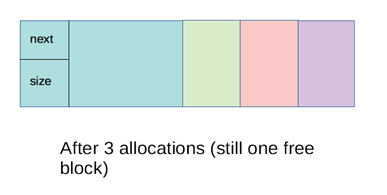

# Ant Allocator

An experimental memory allocator.

See `attempt1` directory for first attempt. Status working - and there
is some limited test code. See README in that directory for full
explanations, details, diagrams, code etc.

## Attempt 2

There were a few issues with attempt 1:

1. The block list contained both free and used blocks. This means walking the list
   for a suitable free block takes longer because the list conatins used blocks.
2. Our block header was big - 40 bytes. It should be possible to reduce this substantially. 
3. The idea of a wilderness complicated things a bit, for not much benefit.

So with attempt 2 the aim is to:

1. Maintain only a list of free blocks.
2. Have a block header that contains only a next ptr and a usermem_sz.
3. Remove the wilderness idea.

What this means is some benefits and some new headaches too:

1. The application needs to maintain a record of both the ptr to
   allocated memory and the size, as we don't keep this information in
   the block list any more for allocated bocks.
2. Walking the list to find a free block should be a lot faster.
3. We reduce the over head by not managing allocated blocks and by
   reducing the block header size.
4. With attempt 1 freeing an allocated block was trivial because you
   had prev and next pointers built in to the block header to help
   figure out whether you could coalesce blocks. With attempt 2 you
   would now have to walk the block list on free to figure out the
   previous and next blocks in the free list.
   
There are some new gotchas too:

1. Not including allocated blocks in the block list leads to an
   interesting problem. You could potentially allocate a block of a
   small size. This is no problem - until that block is freed. At this
   point the block needs to have the block header added so it can be
   added into the free block list. But what if the block's not big
   enough! There'd be no way to add it into the free list. So the dumb
   approach is to just add the bock header size to all
   allocations. The other option is to add the block header size only
   if the allocation is small. So, if our header is 16 bytes, then we
   might add 16 bytes to allocations of less seventeen bytes. So for a
   allocation of one byte, we would add sixteen bytes for a header. It
   hardly seems worth it for one byte though - and we haven't even
   talked about alignment yet either. If you requested seventeen bytes
   you'd not add the header, so when the block was deallocated you'd
   have a free block with a 16 byte header and 1 byte free. Oh dear.
 
2. `ant_alloc()` and `ant_free()` should be an improvement over
   `malloc()` from a programmer's perspective. I want them to return a
   bool to indicate success or failure. `ant_alloc()` should receive a
   memory object and this is passed to `ant_free()` to deallocate the
   object. A memory object looks like:
   
``` C
// Memory object
typedef struct memobj_s {
    void *ptr;
    size_t size;
} memobj_t;
```
 
3. Something I haven't thought of yet! (There's always something)

## Details

### Initializing the list. 

Because there's no wilderness when the heap is created you have a free
block list that consists of one big free block. This is not too bad to
set up.


### First allocation

After the first allocation we have the following:


There are two things we need to do:

* a. Recalculate the new size of the free block
* b. Figure out the pointer to the allocated block

a. To calculate the new size of the free block:

    new_size = old_size - requested_size

b. Calculating pointer: `rover` points at the free block. There are a
couple of ways we can calculate this but the following seems the
simplest:

    p = rover + blockhdr_sz + new_size
    
The returned memory object would contain p and requested_size. 

### After several allocations

Here's the situation after several allocations:



4. Block to be freed

This shows the block to be freed. When you free the block you need to
allow for the block header:


